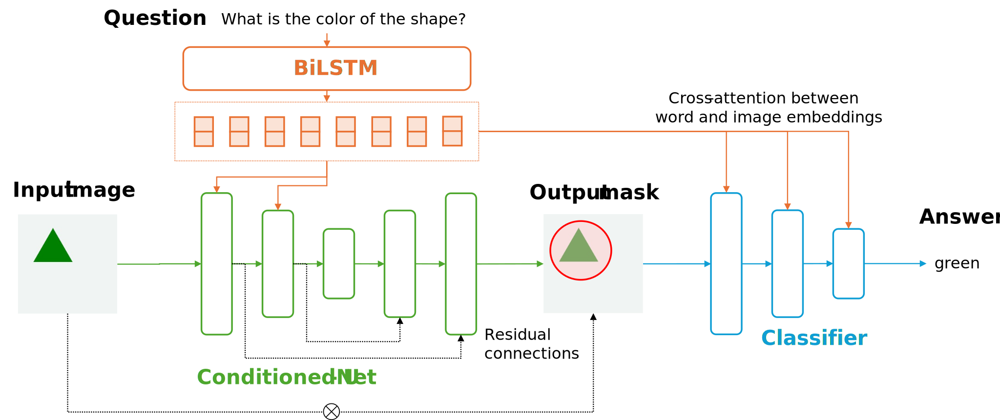

# [I]()nteractive [M]()ultimodal e[X]()planations for [E]()asy [V]()isual [Q]()uestion [A]()nswering ([IMX-EVQA]())

Hi👋! This is a Pytorch implementation of the explainability system proposed in [*A Study on Multimodal and Interactive Explanations for Visual Question Answering* (Alipour et al., 2020)](https://arxiv.org/abs/2003.00431). We adapted their experiments to obtain interactive multimodal explanations based on text and image in the [Easy VQA](https://github.com/vzhou842/easy-VQA) dataset.


Our adaptation is shown in below. We used a [Conditioned U-Net](modules/unet.py) to leverage visual with textual information from the question words. The output is a mask that is applied to the original input image to feed a convolutional classifier with text conditioning. 




**Installation**: Check the libraries [requirements.txt](requirements.txt) to train and deploy our system.

```shell
pip3 install -r requirements.txt
```


## Loading data 

Before training or predicting with our system, it is required to download the [Easy VQA](https://github.com/vzhou842/easy-VQA/tree/master/easy_vqa/data) dataset. The folder `easy_vqa/data` must be downloaded at the root of this repository and renamed as [`easy-vqa`](easy-vqa/). Optionally, run the following terminal commands:

```shell 
!wget https://github.com/vzhou842/easy-VQA/archive/refs/heads/master.zip
!unzip master.zip
!mv easy-VQA-master/easy_vqa/data/ easy-vqa
!rm -r easy-VQA-master/
!rm master.zip
```

The folder structure should look like this:

```
easy-vqa/  
    test/
    train/
    answers.txt
modules/
utils/
model.py
system.py
```

## Training 

Before deploying the system it is required to train the neural network. We suggest to directly run the [system.py](system.py) script to train the model (it is possible to configure some parameters such as the batch size or number of epochs). With the default configuration the model should reach ~90% in F-score. At the end of the training, the system parameters should be stored at `results/` folder.

## Deployment 

See the prepared [demo.ipynb](demo.ipynb) for documentated examples of how to work with interactive multimodal explanations.


